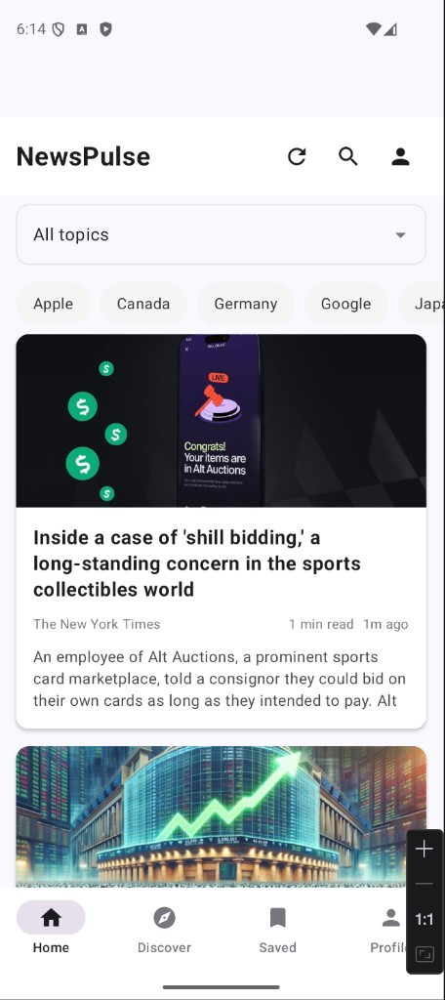
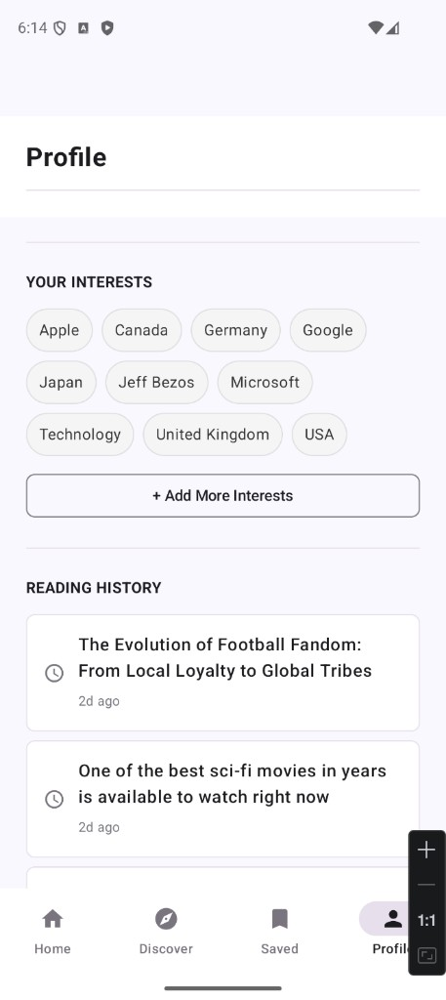
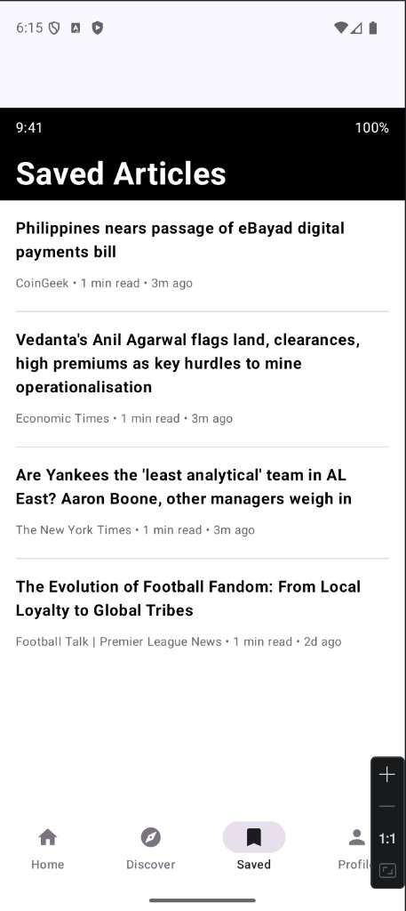

# NewsPulse (Team-101-17)

NewsPulse is an Android app for browsing news and managing topic interests.
It is set up to be demo-ready out of the box with built-in mock data, and can
optionally use live data via NewsAPI.ai.

## Demo quick start (recommended)

This path is best for live demos because it works without external setup.

1. Open the project in Android Studio.
2. Sync Gradle and run the app on an emulator or Android device.
3. Demo the main flow:
   - browse the news feed
   - open an article
   - follow/unfollow interests
   - return to confirm interest state changes are reflected

By default, the app uses deterministic mock articles and a default topic list,
so the demo is stable and repeatable.

## Demo walkthrough with screenshots

### 1) Home feed

Show how users can scan headlines and filter by topic chips.

### 2) Profile and interests

Show the interest chips and demonstrate adding/removing interests to personalize content.

### 3) Saved articles

Show the saved list as proof that article actions persist in the user flow.

## 2-minute live demo script

1. Start on **Home** and call out topic filtering.
2. Open an article, then save it.
3. Move to **Profile** and update one interest.
4. Open **Saved** and confirm the saved article appears.
5. Return to **Home** and highlight that interests/saved content drive personalization.

## Optional: enable live articles (NewsAPI.ai / Event Registry)

If you want live data instead of mocks:

1. Copy `local.properties.example` to `local.properties` (if needed).
2. Add your API key to `local.properties`:
   `NEWSAPI_AI_KEY=your_key_here`
3. Get a key at [newsapi.ai](https://newsapi.ai/).
4. Do **not** commit `local.properties` or your real key (already gitignored).

If no key is provided, the app falls back to mock data automatically.

## Architecture overview

The app follows a layered architecture:

- `ui/` - Compose screens, ViewModels, and theme. Handles rendering and user interactions.
- `domain/` - Core models and repository interfaces. Defines business contracts and stays framework-light.
- `data/` - Repository implementations, persistence/network adapters, and mocks used for tests and demos.

## Useful links

- [Team Contract](../../wikis/Team-Contract)
- [Project Proposal](../../wikis/Project-Proposal)
- [Team Meetings](../../wikis/Team-Meetings)

