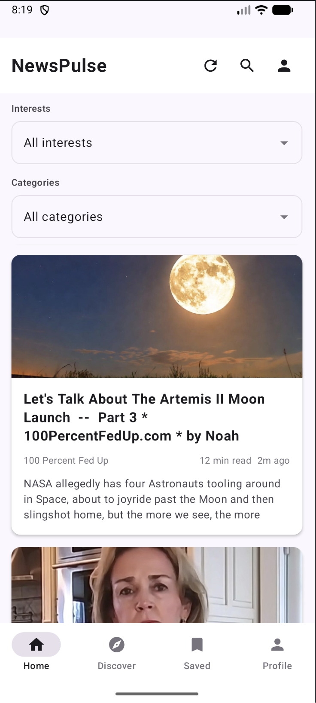

# NewsPulse (Team-101-17)

## Description

**NewsPulse** is an Android app that provides people with tailored news articles and world headlines, to keep them updated on world events, regardless of their interests and lifestyle. NewsPulse surfaces articles by topic and interest, with reading history, saved articles, and makes use of a beautiful layered UI

### About the team

We are a group of CS students who are the absolute best at building great projects. 

### The team members

* Baldeep Pannu
* Aadit Shah
* Ayaan Sarfraz
* Hanson Liu

### Contact

* baldeep.pannu@uwaterloo.ca
* aadit.shah@uwaterloo.ca
* a3sarfraz@uwaterloo.ca
* h239liu@uwaterloo.ca

### Main window

### Demo video

* [TODO - MAKE AND LINK VIDEO](https://www.youtube.com/) 

### Acknowledgements

* [Acknowledgements](https://git.uwaterloo.ca/a44shah/team-101-17/-/wikis/Acknowledgements)

### Releases

* [TODO - ADD RELEASE DOCS]

---

## 2. Project Information

* [Team Contract](https://git.uwaterloo.ca/a44shah/team-101-17/-/wikis/Team-Contract)
* [Project Proposal](https://git.uwaterloo.ca/a44shah/team-101-17/-/wikis/Project-Proposal)
* [Meeting Minutes] https://git.uwaterloo.ca/a44shah/team-101-17/-/wikis/Team-Meetings
* [Team Reflections](https://git.uwaterloo.ca/a44shah/team-101-17/-/wikis/Team-Reflections)

---

## 3. User Guide

* [Getting Started (TODO)]
* [Usage Guide](https://git.uwaterloo.ca/a44shah/team-101-17/-/wikis/Usage-Guide)

---

## 4. Design Documents

* [UML / ERD (Mermaid)](https://git.uwaterloo.ca/a44shah/team-101-17/-/wikis/NewsPulse-UML-Diagram)
* [Class diagrams](https://git.uwaterloo.ca/a44shah/team-101-17/-/wikis/Class-Diagrams)

---

## 5. Grading Instructions

**For the TA**

* **Build:** `./gradlew assembleDebug` should succeed; run the app on an emulator or device as above.
* **API key:** If `NEWSAPI_AI_KEY` is unset, the app still runs with mock data - note when grading live article features.
* **Tests:** `./gradlew testDebugUnitTest` - unit tests for selected ViewModels and domain utilities.

---
